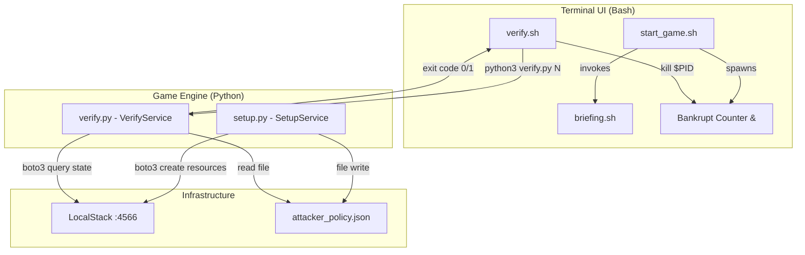

# Design Document: IAM In Trouble

## Overview

"IAM In Trouble" is a terminal-based AWS CLI escape room game where the player acts as an on-call SRE fixing three simulated AWS security incidents. The game runs entirely in a Bash terminal, uses LocalStack (Docker, port 4566) as a mock AWS backend, and Python 3 + boto3 as the verification engine.

The system follows a **Service-Oriented Split** architecture with three components communicating through minimal interfaces: process exit codes and shared LocalStack state.

### Key Design Decisions

1. **Exit code as sole IPC**: VerifyService communicates success/failure to TerminalUI exclusively via exit code (0 = pass, 1 = fail). This eliminates coupling and enables independent development.
2. **LocalStack as implicit persistence**: SetupService writes state to LocalStack; VerifyService reads it. No explicit coordination layer.
3. **Sequential execution model**: Setup runs once before gameplay; Verify runs on-demand during gameplay. No concurrency concerns between Python components.
4. **Bash background process for urgency**: The Bankrupt Counter runs as a `&` subprocess, owned entirely by TerminalUI.

## Architecture



### Component Responsibilities

| Component | File(s) | Responsibility |
|-----------|---------|----------------|
| SetupService | `setup.py` | Provision compromised resources in LocalStack; generate `attacker_policy.json` |
| VerifyService | `verify.py` | Accept level arg, dispatch to level-specific checker, query LocalStack/filesystem, return exit code |
| TerminalUI | `start_game.sh`, `briefing.sh`, `verify.sh` | Render ASCII/narrative, manage Bankrupt Counter lifecycle, bridge player commands to VerifyService |

### Information Flow

1. **Setup Phase**: Player runs `python3 setup.py` → SetupService provisions EC2 instance, S3 bucket, and writes `attacker_policy.json`
2. **Gameplay Phase**: Player uses real `aws` CLI commands against `--endpoint-url=http://localhost:4566`
3. **Verification Phase**: Player runs `./verify.sh N` → TerminalUI invokes `python3 verify.py N` → VerifyService queries state → returns exit code → TerminalUI renders result

### Design-Induced Invariants

- The ONLY runtime interface between VerifyService and TerminalUI is the process exit code (0 or 1)
- SetupService and VerifyService never execute concurrently
- The Bankrupt Counter PID is owned exclusively by TerminalUI
- LocalStack is the implicit persistence layer — Setup writes, Verify reads

## Components and Interfaces

### SetupService (`setup.py`)

**Purpose**: One-shot provisioning of the compromised game state.

**Interface**:
- **Input**: None (reads environment for LocalStack endpoint)
- **Output**: Side effects — EC2 instance created, S3 bucket created, `attacker_policy.json` written
- **Exit codes**: 0 = success, 1 = LocalStack unreachable

**Internal Structure**:
```python
def create_boto3_session() -> boto3.Session:
    """Create session with endpoint_url and dummy credentials."""

def provision_ec2(session) -> str:
    """Spawn p4d.24xlarge instance, return instance_id."""

def provision_s3(session) -> None:
    """Create bucket with public-read ACL."""

def generate_attacker_policy() -> None:
    """Write attacker_policy.json with Deny statement."""

def check_localstack_connectivity(session) -> bool:
    """Verify LocalStack is reachable on port 4566."""

def main():
    """Orchestrate: check connectivity, provision all resources."""
```

**Error Handling**: If LocalStack is unreachable, print descriptive error and `sys.exit(1)`.

---

### VerifyService (`verify.py`)

**Purpose**: Stateless level verification — query state, return binary verdict.

**Interface**:
- **Input**: Single CLI argument — level number string
- **Output**: Exit code (0 = level passed, 1 = level failed or error)
- **Stdout**: Error/usage messages only on failure paths

**Internal Structure**:
```python
def validate_level_arg(args: list[str]) -> int:
    """Validate CLI args. Return level int or exit(1) with message."""

def verify_level_1(session) -> bool:
    """Check EC2 instance state == 'terminated'."""

def verify_level_2(session) -> bool:
    """Check S3 bucket ACL has no AllUsers grants."""

def verify_level_3() -> bool:
    """Parse attacker_policy.json, check no Deny statements exist."""

def main():
    """Parse args, dispatch to level checker, sys.exit based on result."""
```

**Dispatch Logic**:
```python
LEVEL_HANDLERS = {
    1: verify_level_1,
    2: verify_level_2,
    3: verify_level_3,
}
```

---

### TerminalUI (Bash Scripts)

#### `start_game.sh`
- Renders ASCII PagerDuty alert
- Invokes `briefing.sh`
- Spawns Bankrupt Counter as background process (`&`), stores PID

#### `briefing.sh`
- Prints colored narrative (ANSI escape codes) describing the 2:00 AM incident

#### `verify.sh`
- Accepts level number argument
- Invokes `python3 verify.py $1`
- Checks exit code:
  - `0` → render level-specific Victory_Screen
  - `1` → render failure message
- On Level 3 success: render final "Promoted to Senior SRE" screen, `kill $BANKRUPT_PID`

#### Bankrupt Counter (inline in `start_game.sh`)
- Runs in background via `&`
- Uses ANSI cursor save/restore (`\033[s`, `\033[u`) and absolute positioning (`\033[1;70H`)
- Increments dollar amount every ~1 second
- PID stored in variable for later `kill`

## Data Models

### LocalStack State (implicit, managed via boto3)

```
EC2 Instance:
  - InstanceId: string (e.g., "i-abc123")
  - InstanceType: "p4d.24xlarge"
  - State: "running" | "terminated" | ...

S3 Bucket:
  - Name: "customer-passwords-do-not-share"
  - ACL Grants[]:
    - Grantee:
        Type: "Group" | "CanonicalUser"
        URI: string (e.g., "http://acs.amazonaws.com/groups/global/AllUsers")
    - Permission: "READ" | "FULL_CONTROL" | ...
```

### `attacker_policy.json` (filesystem)

```json
{
  "Version": "2012-10-17",
  "Statement": [
    {
      "Effect": "Deny",
      "Action": "dynamodb:*",
      "Resource": "arn:aws:dynamodb:us-east-1:000000000000:table/payroll-database"
    }
  ]
}
```

**Verification criteria**: The `Statement` array must contain zero objects where `Effect == "Deny"`.

### Exit Code Contract

| Scenario | Exit Code |
|----------|-----------|
| Level verification passed | 0 |
| Level verification failed | 1 |
| Invalid/missing argument | 1 |
| File not found / parse error | 1 |
| LocalStack unreachable (setup) | 1 |

## Correctness Properties

*A property is a characteristic or behavior that should hold true across all valid executions of a system — essentially, a formal statement about what the system should do. Properties serve as the bridge between human-readable specifications and machine-verifiable correctness guarantees.*

### Property 1: EC2 Verification Decision

*For any* EC2 instance state string, calling the Level 1 verifier SHALL return exit code 0 if and only if the state equals "terminated"; for any state not equal to "terminated", it SHALL return exit code 1.

**Validates: Requirements 2.3, 2.4**

### Property 2: S3 ACL Verification Decision

*For any* valid S3 ACL grant list, calling the Level 2 verifier SHALL return exit code 0 if and only if no grant in the list has a grantee URI equal to "http://acs.amazonaws.com/groups/global/AllUsers"; otherwise it SHALL return exit code 1.

**Validates: Requirements 3.2, 3.3**

### Property 3: IAM Policy Verification Decision

*For any* valid JSON IAM policy document, calling the Level 3 verifier SHALL return exit code 0 if and only if no Statement in the document has "Effect" equal to "Deny"; otherwise it SHALL return exit code 1.

**Validates: Requirements 4.2, 4.3**

### Property 4: Invalid Level Argument Rejection

*For any* string that is not "1", "2", or "3", calling verify.py with that string SHALL exit with code 1 and print an error message indicating the level number is invalid.

**Validates: Requirements 9.2**

## Error Handling

### SetupService Errors

| Error Condition | Handling | Exit Code |
|----------------|----------|-----------|
| LocalStack not running on :4566 | Print "Error: LocalStack container is not reachable on port 4566. Is Docker running?" | 1 |
| boto3 API error during provisioning | Print error details, abort setup | 1 |

### VerifyService Errors

| Error Condition | Handling | Exit Code |
|----------------|----------|-----------|
| No argument provided | Print usage: "Usage: python3 verify.py <level>\nValid levels: 1, 2, 3" | 1 |
| Invalid level argument | Print: "Error: Invalid level '<arg>'. Must be 1, 2, or 3." | 1 |
| `attacker_policy.json` missing | Print: "Error: attacker_policy.json not found. Run setup.py first." | 1 |
| `attacker_policy.json` invalid JSON | Print: "Error: attacker_policy.json contains invalid JSON." | 1 |
| LocalStack query failure (L1/L2) | Print connection error details | 1 |

### TerminalUI Errors

| Error Condition | Handling |
|----------------|----------|
| verify.py not found | Print: "Error: verify.py not found in current directory" |
| Background counter already terminated | Silently ignore `kill` failure (use `kill 2>/dev/null`) |

## Testing Strategy

### Property-Based Tests (Python — using Hypothesis)

Property-based testing is appropriate for this feature because the VerifyService contains pure decision logic that can be tested with generated inputs:

- **Library**: [Hypothesis](https://hypothesis.readthedocs.io/) for Python
- **Minimum iterations**: 100 per property
- **Test tag format**: `# Feature: iam-in-trouble, Property N: <property text>`

| Property | Generator Strategy | Assertion |
|----------|-------------------|-----------|
| P1: EC2 Verification | Generate random strings for EC2 state (text strategy) | `exit_code == 0` iff `state == "terminated"` |
| P2: S3 ACL Verification | Generate lists of ACL grant dicts with random grantee URIs | `exit_code == 0` iff no grant URI equals AllUsers |
| P3: IAM Policy Verification | Generate valid policy JSON docs with random Statement lists (random Effects) | `exit_code == 0` iff no Statement has `Effect == "Deny"` |
| P4: Invalid Level Rejection | Generate strings from `text()` filtered to exclude "1", "2", "3" | `exit_code == 1` always |

### Unit Tests (Python — using pytest)

Unit tests cover specific examples, edge cases, and integration points:

- Setup generates valid `attacker_policy.json` with correct structure
- Verify with no arguments prints usage and exits 1
- Verify with missing `attacker_policy.json` prints error and exits 1
- Verify with invalid JSON in `attacker_policy.json` prints error and exits 1
- Level 1: terminated instance → exit 0 (mocked boto3)
- Level 2: private ACL → exit 0, public ACL → exit 1 (mocked boto3)
- Level 3: policy without Deny → exit 0, policy with Deny → exit 1

### Integration Tests (manual / scripted)

- Full game flow: `setup.py` → AWS CLI commands → `verify.sh` per level
- Bankrupt Counter spawns and terminates correctly
- ASCII art renders without terminal corruption
- `start_game.sh` → `briefing.sh` invocation chain works

### Test Configuration

```
pytest.ini:
  [pytest]
  testpaths = tests
  markers =
    property: Property-based tests (Hypothesis)
    unit: Unit tests
    integration: Integration tests requiring LocalStack
```
